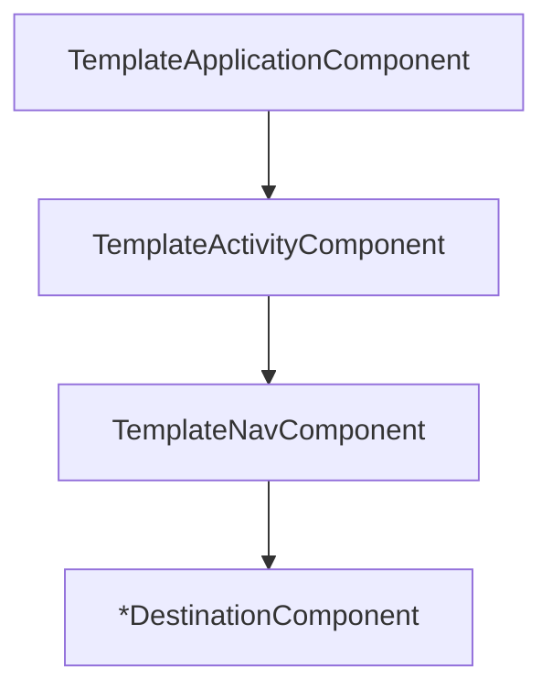

# DI

We use [kotlin-inject] and [kotlin-inject-anvil] for DI.

`kotlin-inject` has native Kotlin support, works with KSP, and has full compile time safety.

It provides similar core capabilities as Dagger, but with a simpler, and much smaller API surface.

`kotlin-inject-anvil` offers a simpler way of creating a dependency graph, in the same way that [Anvil] does for Dagger.

## Terminology

[kotlin-inject] refers to both classes annotated with `@Component`, and provider interfaces as
components. In this project we refer to the former as components, and the latter as modules.

## Template DI

The scope hierarchy that we use in this project is as follows:



`TemplateApplicationComponent` is the root, and uses [MergeComponent] to include all of the modules contributed to the `AppScope`.

`TemplateActivity` is a [SubComponent] of `TemplateApplicationComponent`, and includes all of the modules contributed to the `ActivityScope`.

`TemplateNavComponent` is a [SubComponent] of `TemplateActivityComponent`, and includes all of the modules contributed to the `NavScope`.
In practice, this only exists so that `TemplateActivityComponent` can remain isolated in the `app` module. Otherwise `TemplateActivityComponent`
would have to be moved into its own module, so that both the `app` and `nav` modules can access it.

Each `*DestinationComponent` is a [SubComponent] of `TemplateNavComponent`, and has a 1:1 relationship with its [Destination].
It is used to create the `ViceDestination` in `TemplateNav`.

### Scoped Singleton

A dependency can be provided as a singleton in a given scope by using [SingleIn]:

```kotlin
// a new instance of Foo will be created each time it needs to be injected
@Inject
class Foo

// the instance of Foo will be cached in the scoped Component, e.g. in `TemplateActivityComponent`
@Inject
@SingleIn(ActivityScope::class)
class Foo
```

### kotlin-inject-anvil

Without [kotlin-inject-anvil], each component would have to manually implement each module:

```kotlin
class Foo

interface FooModule {
  @Provides fun providesFoo(): Foo = Foo()
}

interface Bar

@Inject
class RealBar : Bar

interface BarModule {
  @Provides fun RealBar.bind(): Bar = this
}

@Component
abstract class AppComponent : FooModule, BarModule
```

We can use code generation to simplify these two use cases:

> [!IMPORTANT]
> The Gradle module that the `Component` lives in must be able to see the types that use the following annotations.
> If it can't, the code won't get generated correctly, and the build will fail.

#### Contributing Modules

Instead of a component manually implementing a module, [ContributesTo] can be used to generate the glue code
that will result in the component implementing the module:

```kotlin
@ContributesTo(AppScope::class)
interface FooModule {
  @Provides fun providesFoo(): Foo = Foo()
}
```

#### Binding interfaces

Instead of manually creating a module that contains an `@Provides` function binding an interface to an implementation,
[ContributesBinding] can be used to generate one automatically:

```kotlin
interface Bar

@Inject
@ContributesBinding(AppScope::class)
class RealBar : Bar
```

## Gradle

Any module that has a `@MergeComponent`, `@ContributesSubcomponent`, `@ContributesTo`, or `@ContributesBinding`
should follow this recipe:

```kotlin
plugins {
  // other plugins
  alias(libs.plugins.ksp)
}

dependencies {
  implementation(libs.kotlinInject.anvilRuntime)
  // usually also need the optional runtime for SingleIn, AppScope, etc...
  implementation(libs.kotlinInject.anvilRuntimeOptional)

  ksp(libs.kotlinInject.anvilCompiler)
}
```

## Tests

### Unit Tests

It usually makes more sense to either create subjects using manual DI, or by creating a test specific
component.

> [!NOTE]
> When creating a test specific component, it might make more sense to use a regular `@Component` instead of a
> `@MergeComponent`. If that is the case, you need to add `kspTest(libs.kotlinInject.compiler)` to the Gradle module's
> dependencies.

### Integration / E2E Tests

The [current suggested approach](https://github.com/amzn/kotlin-inject-anvil/issues/79) is to use `exclude` on your
test `@MergeComponent` to remove the modules that shouldn't be used for the test. The eventual plan is to introduce
`replaces` on `ContributesTo` and `ContributesBinding` to make this more ergonomic.

## Why not Dagger / Hilt / Koin?

### Dagger

Dagger is a very powerful DI framework, but with great power comes great responsibility.
Dagger is not meant to be easy to learn or implement, and offers a lot of advanced features that aren't
necessarily needed outside of Google scale projects. Unfortunately there's no protection against using those
features, and even if you don't use them, their complexity can leach into a codebase accidentally.

Dagger needs to use KAPT in a Kotlin project, which is slower than KSP, since it needs to generate
Java stubs to run through the Java annotation processor. It can also cause weird build instabilities.

There is alpha support for KSP1, however there is no plan to develop that further due to performance
issues, and KSP2 support is not coming soon (or guaranteed to work well)<sup>[1]</sup>.

### Hilt

Hilt has the same downsides as Dagger, but has a little bit nicer support for Android projects.

### Koin

Koin is becoming a popular option, but doesn't have compile time safety
by default (the graph is validated at runtime). There is some support for it now
with Koin Annotations, but there are escape hatches to bypass the safety which make it not ideal.

There is a slight runtime performance disadvantage to Koin that scales
up with your codebase, which can lead to user perceivable performance issues.

[1]: https://github.com/google/dagger/issues/2349#issuecomment-2329852274

[Anvil]: https://github.com/square/anvil
[ContributesBinding]: https://github.com/amzn/kotlin-inject-anvil/blob/main/runtime/src/commonMain/kotlin/software/amazon/lastmile/kotlin/inject/anvil/ContributesBinding.kt
[ContributesTo]: https://github.com/amzn/kotlin-inject-anvil/blob/main/runtime/src/commonMain/kotlin/software/amazon/lastmile/kotlin/inject/anvil/ContributesTo.kt
[Destination]: ./UI.md#destinations
[MergeComponent]: https://github.com/amzn/kotlin-inject-anvil/blob/main/runtime/src/commonMain/kotlin/software/amazon/lastmile/kotlin/inject/anvil/MergeComponent.kt
[SingleIn]: https://github.com/amzn/kotlin-inject-anvil/blob/main/runtime-optional/src/commonMain/kotlin/software/amazon/lastmile/kotlin/inject/anvil/SingleIn.kt
[SubComponent]: https://github.com/amzn/kotlin-inject-anvil/blob/main/runtime/src/commonMain/kotlin/software/amazon/lastmile/kotlin/inject/anvil/ContributesSubcomponent.kt

[kotlin-inject]: https://github.com/evant/kotlin-inject
[kotlin-inject-anvil]: https://github.com/amzn/kotlin-inject-anvil
