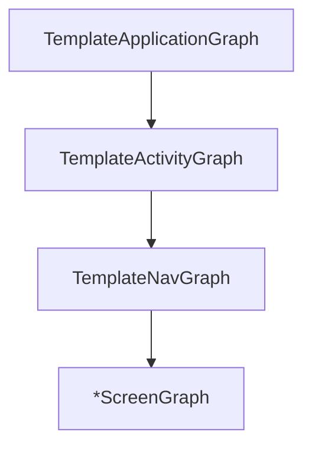

# Dependency Injection

We use [Metro] for DI.

Metro has native Kotlin support, uses Kotlin compiler plugins (faster than KSP/KAPT), and has full compile-time safety. It combines the best of Dagger and kotlin-inject with a simpler API.

## Detailed Documentation

See [di/](di/) for comprehensive documentation:
- [di/scopes.md](di/scopes.md) - AppScope, ScreenScope hierarchy
- [di/providers.md](di/providers.md) - ContributesTo, ContributesBinding
- [di/testing.md](di/testing.md) - Test components and fakes
- [di/alternatives.md](di/alternatives.md) - Why not Dagger/Hilt/Koin

## Terminology

| Term            | Meaning                                         |
|-----------------|-------------------------------------------------|
| Graph           | Class annotated with `@DependencyGraph`         |
| GraphExtension  | Child graph annotated with `@GraphExtension`    |
| Providers       | Interface with `@Provides` functions            |
| Scope           | Lifecycle boundary (App, Activity, Screen)      |

## Template DI

The scope hierarchy that we use in this project is as follows:



`TemplateApplicationGraph` is the root, and uses `@DependencyGraph` to include all modules contributed to `AppScope`.

`TemplateActivityGraph` is a child of `TemplateApplicationGraph`, and includes modules contributed to `ActivityScope`.

`TemplateNavGraph` is a child of `TemplateActivityGraph`, and includes modules contributed to `NavScope`.
In practice, this only exists so that `TemplateActivityGraph` can remain isolated in the `apps/android` module.

Each `*ScreenGraph` is a child of `TemplateNavGraph`, and has a 1:1 relationship with its screen.

### Scoped Singleton

A dependency can be provided as a singleton in a given scope by using `@SingleIn`:

```kotlin
// a new instance of Foo will be created each time it needs to be injected
@Inject
class Foo

// the instance of Foo will be cached in the scoped Graph
@Inject
@SingleIn(AppScope::class)
class Foo
```

### Contributing Modules

Instead of manually implementing interfaces, use `@ContributesTo` to generate the wiring:

```kotlin
@ContributesTo(AppScope::class)
interface FooProviders {
  @Provides fun provideFoo(): Foo = Foo()
}
```

### Binding Interfaces

Use `@ContributesBinding` to automatically bind an implementation to its interface:

```kotlin
interface Bar

@Inject
@ContributesBinding(AppScope::class)
class RealBar : Bar
```

## Gradle

Any module that uses Metro annotations should follow this recipe:

```kotlin
plugins {
  alias(libs.plugins.metro)
}
```

## Tests

### Unit Tests

Prefer manual DI or test-specific graphs:

```kotlin
class MyModelTest {
  @Test
  fun `test something`() {
    val fakeRepo = FakeUserRepository()
    val model = MyModel(fakeRepo) // Manual injection
    // test...
  }
}
```

### Integration / E2E Tests

Use `exclude` on your test `@DependencyGraph` to remove production modules.

## Why not Dagger / Hilt / Koin?

See [di/alternatives.md](di/alternatives.md) for a detailed comparison.

**Summary**: Metro provides native Kotlin support, compile-time safety, simple API, and fast builds via compiler plugin.

[Metro]: https://github.com/ZacSweers/metro
