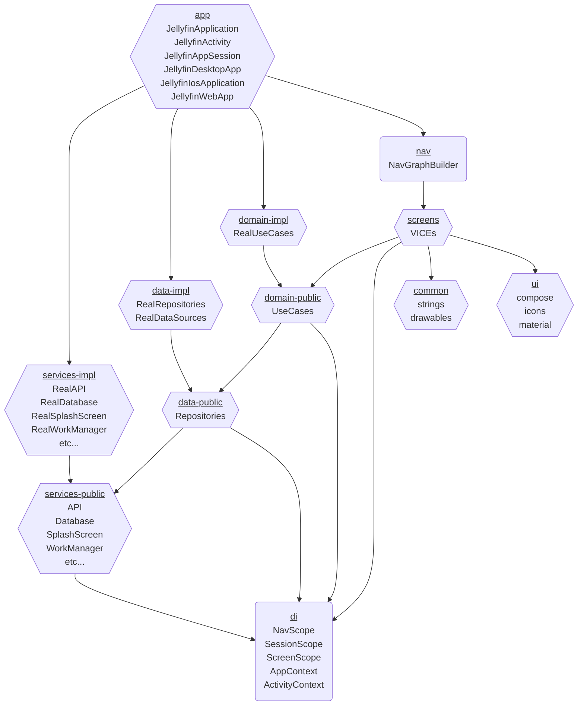

[Android At Scale] nicely lays out why having a small graph height is important to build performance.

To achieve that, we should aim to use `public` and `impl` modules for each `data`, `domain`, and `service` when possible.

It doesn't currently make sense to do this for `screen` modules since no one depends on them aside for `nav` and `app`.

Because of how the scoping is set up in [Jellyfin DI] all of the graphs are created in the `app` module, so that is the only
module that implementation details are exposed (technically `screen` implementation details are exposed in `nav`, but
that is OK since `nav` is really just an extension of `app`).

[Android At Scale]: https://www.droidcon.com/2019/11/15/android-at-scale-square/
[Jellyfin DI]: ./di/README.md
