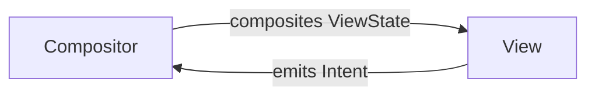

# VICE Pattern

[VICE](https://github.com/eygraber/vice) is the MVI framework used for all screens.

## Components

Each screen module contains:

| Component  | Purpose                                  | File             |
|------------|------------------------------------------|------------------|
| ViewState  | Immutable UI state                       | `*ViewState.kt`  |
| Intent     | User actions                             | `*Intent.kt`     |
| Compositor | Routes Intents, composites ViewState     | `*Compositor.kt` |
| Model      | Business logic (ViceSource)              | `*Model.kt`      |
| Effects    | Optional side effects not related to UDF | `*Effects.kt`    |
| View       | Composable UI                            | `*View.kt`       |

## Data Flow



## Component Responsibilities

### Model
- Encapsulates business logic
- Implements `ViceSource` or one of its specialized descendants for state management
- See [the ViceSource section of the VICE documentation](https://github.com/eygraber/vice?tab=readme-ov-file#vicesource) for what options are available

#### ViceSource

`ViceSource` aims to make it simple to provide data to a `ViceCompositor`:

```kotlin
interface ViceSource<T> {
  @Composable
  fun currentState(): T
}
```

`currentState()` can be backed by any source that can cause the function to recompose when data is changed.
It should provide a single piece of data for the `ViewState`, and should be read in `ViceCompositor.composite`
in order to create the `ViewState`.

There are several implementations provided by VICE that cover common use cases.

#### Injecting Dependencies into Models

Models receive dependencies through constructor injection:

```kotlin
@Inject
@SingleIn(ScreenScope::class)
class MyScreenModel(
  private val repository: MyRepository,
  private val dispatchers: JellyfinDispatchers,
) : ViceSource<MyViewState>() {

  @Composable
  override fun currentState(): MyViewState {
    // ...
    return MyViewState(title = "Title")
  }
}
```

### Compositor
- Routes intents to appropriate handlers
- Combines state from multiple sources
- Should NOT contain business logic
  - In extremely simple cases where the overhead of creating a Model to handle the logic would be more than the logic
    itself, the logic can be contained in the Compositor

```kotlin
@Inject
class MyCompositor(
  private val model: MyModel,
) : ViceCompositor<MyIntent, MyViewState> {
  // Route intents, compose state
}
```

### Effects
- Handles side effects not related to the UDF
- Is not required unless this type of behavior is needed

### Intent
- In most cases, each `Intent` should implement `ThrottlingIntent` so accidental repeated user interactions are throttled
- This can be omitted for cases where throttling is not desired

## NavEntry Integration

Each screen provides a `ViceNavEntryProvider`:

```kotlin
@ContributesNavEntryProvider(NavScope::class, MyKey::class)
@Inject
class MyNavEntry(
  private val graphFactory: MyGraph.Factory,
) : ViceNavEntryProvider<MyKey> {
  // Creates screen with DI
}
```

## Creating New Screens

Use the generator script:

```bash
.scripts/generate_module --feature=<FeatureName>
```

This creates all VICE components, DI setup, navigation integration, and tests.
